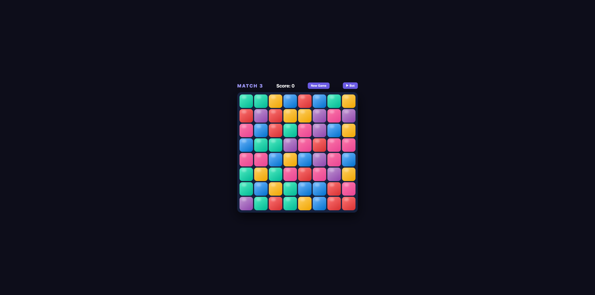

# Match-3 — Built with Claude Code

A match-3 puzzle game built entirely through conversation with [Claude Code](https://claude.ai/code), Anthropic's AI coding assistant. No manual coding — every line was written or revised by the AI based on natural language instructions.

## The Process

Started with a single prompt: *"create a match-3 game in this directory, no restrictions on language or stack."* Claude chose vanilla HTML/CSS/JS (single file, no dependencies) and produced a working base in one shot.

From there, the game was iterated through a back-and-forth conversation:

1. **Falling animation** — tiles initially all dropped from the same top position; asked for each tile to fall its own distance from where it originally was
2. **Sound effects** — added via Web Audio API (oscillators + gain nodes, no asset files)
3. **Swap animation** — CSS transitions for forward swap; then fixed invalid-swap not animating back
4. **CSS cascade bug** — `.matched` was defined before `.spawn` in the stylesheet; when both classes were present during a cascade, the wrong animation won; fixed by reordering
5. **Auto-play bot** — added a bot that scans for valid swaps and plays automatically
6. **Match bug** — after a valid swap, the wrong tiles were disappearing; root cause: `render()` was missing before the cascade loop, so `cellEl()` was querying stale DOM elements with CSS transforms still applied

## What This Demonstrates

- AI can produce a complete, working interactive app from a vague one-line prompt
- Iterative refinement through natural language works well for UI/animation bugs
- Some bugs (especially involving DOM state and CSS animation timing) required careful back-and-forth to diagnose — the AI identified root causes rather than just patching symptoms

## Play

[http://blog.xiuz.hu/match3-cc/](http://blog.xiuz.hu/match3-cc/)

